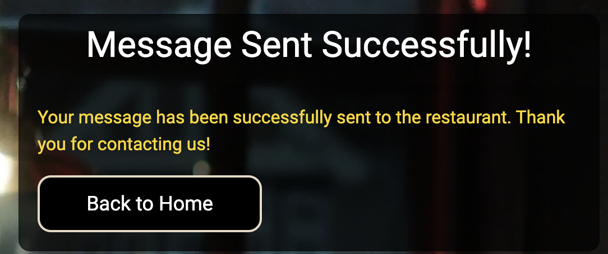

# Garden and Grill

* Garden and Grill is a fictional restaurant located in the centre of stockholm. It is a full-stack web project built using the Django MVC framework. The project aims to provide a user friendly platform where customers can make table reservations at the restaurant "Garden and Grill." The system has been developed with a focus on user experience, security, and efficient reservation management, both for restaurant administrators and guests. [The live link can be found here:](https://gardengrill-d40b8e344381.herokuapp.com/)

## Table of Contents
1. [Introduction](#garden-and-grill)
2. [Agile Planning](#agile-planning)
3. [Features](#features)
   - [Users (Guests)](#users-guests)
   - [Administrators](#administrators)
4. [Technologies Used](#technologies-used)
5. [Navigation Bar](#navigation-bar)
   - [Logged-in User](#logged-in-user)
   - [Not Logged-in User](#not-logged-in-user)
   - [Smaller Screens](#smaller-screens)
6. [Footer](#footer)
7. [Home Page](#home-page-not-logged-in-user)
   - [Home Page (Logged in User)](#home-page-logged-in-user)
   - [Home Page (Logged in Admin)](#home-page-logged-in-admin)
8. [Menu](#menu)
9. [Register](#register)
10. [Login](#login)
11. [Create Reservation](#create-reservation)
   - [Create Reservation (User)](#create-reservation-user)
   - [Create Reservation (Admin)](#create-reservation-admin)
12. [Reservation Success](#reservation-success)
13. [Current Reservations](#current-reservations)
14. [Manage Reservation (Admin)](#manage-reservation-admin)
   - [Edit Reservation (Admin)](#edit-reservation-admin)
   - [Cancel Reservation (Admin)](#cancel-reservation-admin)
15. [Contact Us](#contact-us)
16. [404 Error Page](#404-error-page)
   - [404 Error Page (Admin)](#404-error-page-admin)
   - [404 Error Page (User)](#404-error-page-user)
17. [500 Error Page](#500-error-page)
18. [Favicon](#favicon)
19. [Bugs](#bugs)
20. [Testing and Validation](#testing-and-validation)
21. [Features Left to Implement](#features-left-to-implement)
22. [Deployment](#deployment)
23. [Credits](#credits)

## Agile planning

## Agile Development Approach

* This project followed a simplified Agile methodology. The work was broken down into small, manageable user stories, each with clear acceptance criteria. 

### Sprints
* This project followed a simplified Kanban methodology. Tasks were tracked and managed using a Kanban board in GitHub Projects, with user stories moving from “To Do” to “In Progress” to “Done” as work progressed. This allowed for continuous delivery of features without the time-boxed structure of sprints.

### Prioritization
* Tasks were labeled based on priority, following the categories:
- **Must have:** Core features necessary for project functionality.
- **Should have:** Important features that enhance the user experience but are not critical.
- **Could have:** Optional features that would be nice to implement if time allowed.

### Kanban Board
I utilized GitHub Projects to track and organize user stories. The Kanban board visually represented the progress of each task from “To Do” to “Done.” Each user story included clear acceptance criteria to define when the task could be marked as complete.

## Features

### Users (Guests)
* Users can register, log in and log out.
* Guests can book a table using a simpl form where they enter their name, date, time and number of guests.
* Guests can manage their booking by sending a request email to the restaurant.
* When a reservation is created, updated or canceled the user recieves a confirmation email.

### Administrators
* Administrators have access to a list that displays all current reservations and can edit or cancel reservations.
* Administrators can see available spots so that admin have a clear view on the restaurants capacity during the day.
* The system automatically removes expired reservations to ensure it remains up to date.

## Tecknologies used
* Django
* Html
* CSS
* Javascript
* Python
* Bootstrap

## Wireframes

### Home Page

<table>
  <tr>
    <td>
      
    </td>
    <td>
      
    </td>
  </tr>
</table>

### Log in page

<table>
  <tr>
    <td>
      
    </td>
    <td>
      
    </td>
  </tr>
</table>

### Register page 

<table>
  <tr>
    <td>
      
    </td>
    <td>
      
    </td>
  </tr>
</table>

### Menu page

<table>
  <tr>
    <td>
      
    </td>
    <td>
      
    </td>
  </tr>
</table>

### Navigation bar 
* The navigationbar appears on every page and is responsive.
* It helps to organize content for an easy to use experience.
* Clicking on the logo will direct the user to home page.
* The Navbar looks different depending the users logged in status.

#### Logged-in user

  

#### Not logged-in user

  

#### Smaller screens
*  On smaller screens, the navbar uses a hamburger icon with a dropdown menu.
  

## Footer
* The footer has a transparent color scheme that complements the background and contains links to social media pages that open in a new tab.

## Home page (Not logged in user)

* The home page offers a warm and welcoming message with clear links to the 'Log In' and 'Register' pages, as well as a clearly visible menu button. Users are encouraged to log in, register, or explore the menu, making it easy for potential guests to view the offerings and make a reservation.

## Home page (Logged in user)

* For logged in users, the home page displays a personalized welcome message and provides a 'Create Reservation' button, making it easy for users to make a reservation.

## Home page (Logged in Admin)

* For logged in admins, the home page features two buttons that allow them to manage and create reservations.

## Menu
* The menu page displays a list where users can easily view detailed information about what the restaurant offers for lunch, dinner, dessert, and drinks. The menu is scrollable, allowing users to browse through all offerings seamlessly.

## Register 

* The register page contains a form where users must provide a username, email, and password to complete the registration. 

## Login

* The login page includes fields for 'Username' and 'Password' along with a 'Login' button. Beneath the button, there’s a message: 'Don’t have an account?' with a link directing users to the registration page for sign up.

## Create reservation (User)

* This page contains a form with fields for name, date, time, number of guests, and a submit button, allowing users to easily create a reservation.

## Create reservation (Admin)

* The admin version of the page includes an additional email field to manage reservations more effectively.

## Reservation success

* A clear message is displayed to the user with important details about their reservation.

## Current reservations

* This page displays details of the logged in user's current reservations and includes an edit button, allowing users to contact the restaurant if they wish to change or cancel their reservation.

## Manage reservation (Admin)

* Admins have a clear, easy to read view of current reservations. They can edit or cancel reservations, and when an action is taken, a message is displayed on the page.

 * When an admin edits a reservation, a confirmation message appears on the page.

 

 * When an admin cancels a reservation, a cancellation message is shown on the page.

 

## Edit reservation (Admin)

* Admins can easily change reservation details. The page contains a form with fields for name, date, time, and number of guests. Pressing the update reservation button, a confirmation email is automatically sent to the user.

## Contact us 

This page contains a simple form with three input fields: Reservation Name, Email, and Message. Users can fill out this form to reach out to the restaurant for questions or updates related to their reservations.

## Email success

* 

## 404 error page (Admin)

* The 404 error page informs admins that the page they are looking for doesn't exist. It provides a simple message and a clear button to navigate admins back to the admin dashboard.

## 404 error page (User)

* The 404 error page for users works similarly to the admin page, featuring a button that navigates the user back to the home page. 

## 500 error page  

* The 500 error page informs users of an internal server error, indicating the server encountered a problem and couldn't complete their request. It also includes a clear button that navigates users back to the home page.

## Favicon 

* The restaurant's favicon is a simple representation of "Garden and Grill," designed to help users easily locate the site when multiple tabs are open.

## Bugs

## Testing and validation

For easier readability of the README, I chose to add a separate file for [testing](./testing.md).

## Features left to implement
* Forgot password
* Search bar so that admin can easily find existing reservations.

## Deployment

* This app was deployed to Heroku
  * Sign up for Heroku
  * Click "create new app"
  * Give the app a unique name
  * Click settings in the section on top of the page
  * Scroll down and press "Add buildpack"
  * 
  * Click deploy in the section on top of the page
  * Select method "Connect to Github" then press "Connect to Github" button
  * Search for Garden_grill
  * Click connect
  * Click "Enable automatic deploys" button to enable Heroku to rebuild the app when a new change is pushed to Github

## Credits
* My mentor Gareth McGirr
