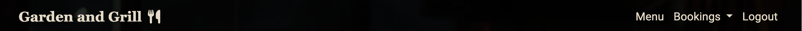
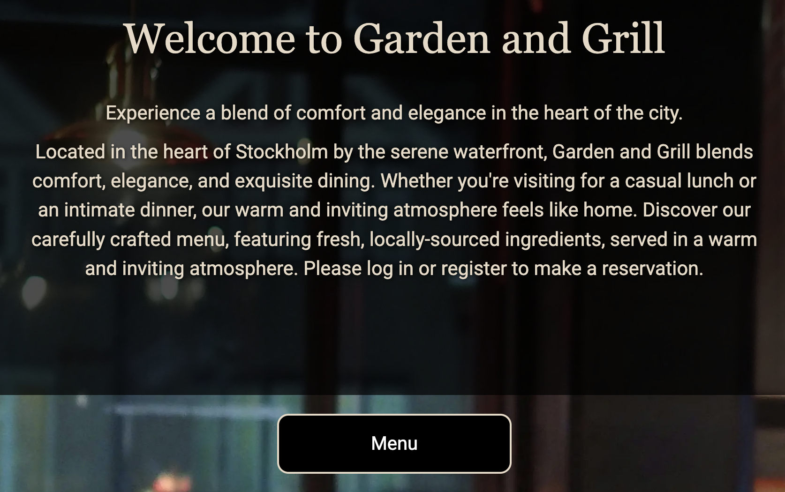
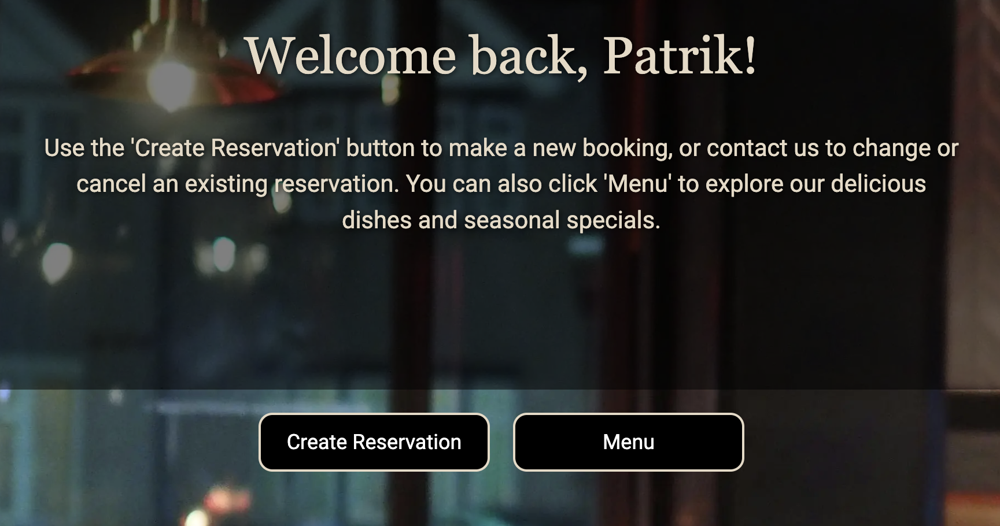

# Garden adn Grill

* Garden and Grill is a fictional restaurant located in the centre of stockholm. It is a full-stack web project built using the Django MVC framework. The project aims to provide a user friendly platform where customers can make table reservations at the restaurant "Garden & Grill." The system has been developed with a focus on user experience, security, and efficient reservation management, both for restaurant administrators and guests. [The live link can be found here:](https://gardengrill-d40b8e344381.herokuapp.com/)

## Agile planning

## Features

### Users (Guests)
* Users can register, log in and log out.
* Guests can book a table using a simpl form where they enter their name, date, time and number of guests.
* Guests can manage their booking by sending a request email to the restaurant.
* When a reservation is created, updated or canceled the user recieves a confirmation email.

### Administrators
* Administrators have access to a list that displays all current reservations and can edit or cancel reservations.
* Administrators can see available spots so that admin have a clear view on the restaurants capacity during the day.
* The system automatically removes expired reservations to ensure it remains up to date.

## Tecknologies used
* Django
* Html
* CSS
* Javascript
* Python
* Bootstrap

### Navigation bar 
* The navigationbar appears on every page and is responsive.
* It helps to organize content for an easy to use experience.
* Clicking on the logo will direct the user to home page.
* The Navbar looks different depending the users logged in status.

#### Logged-in user

  

#### Not logged-in user

  

#### Smaller screens
*  On smaller screens, the navbar uses a hamburger icon with a dropdown menu.
  

## Footer
* The footer has a transparent color scheme that complements the background and contains links to social media that open in a new tab.

## Home page (Not logged in user)

* The home page offers a warm and welcoming message with clear links to the 'Log In' and 'Register' pages, as well as a clearly visible menu button. Users are encouraged to log in, register, or explore the menu, making it easy for potential guests to view the offerings and make a reservation.

## Home page (Logged in user)

* For logged in users, the home page displays a personalized welcome message and provides a 'Create Reservation' button, making it easy for users to make a reservation.

## Home page (Logged in Admin)

* For logged in admins, the home page features two buttons that allow them to manage and create reservations.

## Menu
* The menu page displays a list where users can easily view detailed information about what the restaurant offers for lunch, dinner, dessert, and drinks. The menu is scrollable, allowing users to browse through all offerings seamlessly.

## Register 

* The register page contains a form where users must provide a username, email, and password to complete the registration. 

## Register success

## Login

* The login page includes fields for 'Username' and 'Password' along with a 'Login' button. Beneath the button, there’s a message: 'Don’t have an account?' with a link directing users to the registration page for sign up.

## Create reservation

* This page contains a form with fields for name, date, time, number of guests, and a submit button, allowing users to easily create a reservation.

## Reservation success

* A clear message is displayed to the user with important details about their reservation.

## Current reservations

* This page displays details of the logged in user's current reservations and includes an edit button, allowing users to contact the restaurant if they wish to change or cancel their reservation.

## Manage reservation (Admin)

* Admins have a clear, easy to read view of current reservations. They can edit or cancel reservations, and when an action is taken, a message is displayed on the page.

 * When an admin edits a reservation, a confirmation message appears on the page.

 

 * When an admin cancels a reservation, a cancellation message is shown on the page.

 

## Edit reservation (Admin)

* Admins can easily change reservation details. The page contains a form with fields for name, date, time, and number of guests. Pressing the update reservation button, a confirmation email is automatically sent to the user.

## Contact us 

## Bugs

## Testing and validation

## Features left to implement
* Forgot password
* Search bar so that admin can easily find existing reservations.
## Deployment