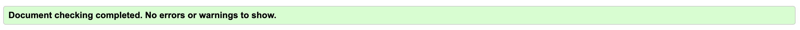
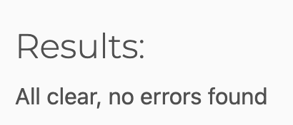
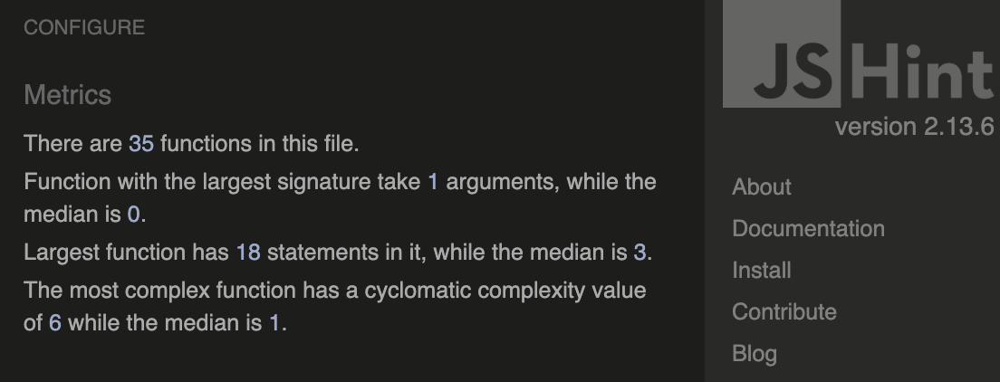
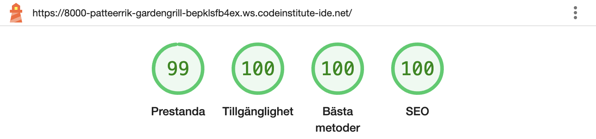
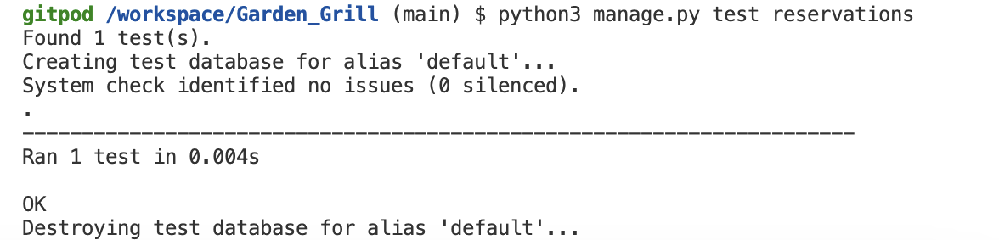

## Manual testing

#### Navigation and Links

* For not inlogged users

| Action | Expectation| Result|
| --- | --- | --- |
| Click on all the links in the navbar and footer. | The user is navigated to the correct page without errors. | The user is navigated to the correct page without errors. |
| Click on "Menu" button | The user is navigated to the "Menu" page | The user is navigated to the "Menu" page |
| Click on "Show Map" | The map becomes visible | The map becomes visible |
| Click on "Create Reservation" | The user is redirected to the login page before accessing the reservation form | The user is redirected to the login page before accessing the reservation form |
| Click on "Create Reservation", then log in | The user is redirected directly to the "Create Reservation" page after logging in. | The user is redirected directly to the "Create Reservation" page after logging in. |
| Click on "Create Reservation" button on the "Menu" page | The user is redirected to the login page before accessing the reservation form | The user is redirected to the login page before accessing the reservation form |

* For logged in users

| Action | Expectation| Result|
| --- | --- | --- |
| Click on "Garden and Grill" logo | The user is navigated to the main page | The user is navigated to the main page |
| Click on "Create Reservation" button | The user is navigated to the "Create Reservation" page | The user is navigated to the "Create Reservation" page |
| Click on "Menu" button | The user is navigated to the "Menu" page | The user is navigated to the "Menu" page |
| Click on "Create reservation" link in the navbar | The user is navigated to the "Create reservation" page | The user is navigated to the "Create reservation" page |
| Click on "Contact Us" link in the navbar | The user is navigated to the "Contact Us" page | The user is navigated to the "Contact Us" page |
| Click on "My reservation" link in the navbar | The user is navigated to the "My reservation" page | The user is navigated to the "My reservation" page |
| Click on  "Show Map" | The map becomes visible | The map becomes visible |
| Click on "Create Reservation" button on the "Menu" page | The user is navigated to the "Create Reservation" page | The user is navigated to the "Create Reservation" page |

* For logged in admin

| Action | Expectation| Result|
| --- | --- | --- |
| Click on navbar and footer links | The admin is navigated to the correct page | The admin is navigated to the correct page |
| Click on "Create Reservation" button | The admin is navigated to the "Create Reservation" page | The admin is navigated to the "Create Reservation" page |
| Click on "Managed Reservation" button | The admin is navigated to the "Current Reservation" page | The admin is navigated to the "Current Reservation" page |

#### User Registration

| Action | Expectation | Result |
| --- | --- | --- |
| Submit registration form with valid data | The user is successfully registered and redirected to home page. And registration email is sent to user | The user is successfully registered and redirected to home page. And registration email is sent to user |
| Submit registration form with missing username | A message "Please enter your username." appears | A message "Please enter your username." appears |
| Submit registration form with missing email | A message "Please enter a valid email." appears | A message "Please enter a valid email." appears |
| Submit registration form with invalid email format | A message "Please enter a valid email." appears | A message "Please enter a valid email." appears |
| Submit registration form with missing password | A message "Please enter your password." appears | A message "Please enter your password." appears |
| Submit registration form with missing confirm password | A message "Please confirm your password." appears | A message "Please confirm your password." appears |
| Submit registration form with mismatched password and confirm password | A message "Passwords do not match" appears | A message "Passwords do not match" appears |

#### Login and Logout

| Action | Expectation | Result |
| --- | --- | --- |
| Log in with valid credentials | The user is logged in and redirected to main page | The user is logged in and redirected to main page |
| Log in with invalid credentials | A message "Invalid username or password" appears | A message "Invalid username or password" appears |
| Enter with a empty username field on the login page | A message "Please enter your username." appears | A message "Please enter your username." appears |
| Enter with a empty password field on the login page | A message "Please enter your password." appears | A message "Please enter your password." appears |
| Log out after being logged in | The user is logged out and redirected to home page | The user is logged out and redirected to home page |
| Click 'Register here' link under log in form | User is navigated to register page | User is navigated to register page |
| User session ends when the browser is closed | The session is terminated and the user is logged out | The session is terminated and the user is logged out |
| User session ends after 10 minutes of inactivity | The session is terminated and the user is logged out | The session is terminated and the user is logged out |

#### Booking System (User)

| Action | Expectation | Result |
| --- | --- | --- |
| Click on "Edit" from "Your current reservations" page as a logged in user | The user is navigated to the "Contact Us" page | The user is navigated to the "Contact Us" page |

##### Create reservation (User)

| Action | Expectation | Result |
| --- | --- | --- |
| Create a reservation as a guest | The reservation is created, a confirmation message with details appears, a confirmation email is sent to the user, and the reservation appears in the reservation list | The reservation is created, a confirmation message with details appears, a confirmation email is sent to the user, and the reservation appears in the reservation list |
| Submit the form without entering a username | A message "Please enter your name." appears | A message "Please enter your name." appears |
| Submit the form without entering a date | A message "Please select a date." appears | A message "Please select a date." appears |
| Attempt to book a past date | A message "The reservation date cannot be in the past." appears | A message "The reservation date cannot be in the past." appears |
| Submit the form without entering a time | A message "Please select a time." appears | A message "Please select a time." appears |
| Attempt to book a time outside of restaurant hours | A message "The reservation time must be between 12:00 PM and 10:00 PM." appears | A message "The reservation time must be between 12:00 PM and 10:00 PM." appears |
| Submit the form without entering the number of guests | A message "Please enter the number of guests." appears | A message "Please enter the number of guests." appears |
| Attempt to book more than 50 seats (max capacity) for a specific time slot | A message "The selected time is fully booked." appears | A message "The selected time is fully booked." appears |

#### Booking System (Admins)

| Action | Expectation | Result |
| --- | --- | --- |
| Click on "Edit" from "Current reservations" page as a logged in admin | The admin is navigated to the "Edit Reservation" page | The admin is navigated to the "Edit Reservation" page |
| Click on "Cancel" from "Current reservations" page as a logged in admin | A message "Reservation has been canceled. Cancellation email sent." appears, and the page refreshes | A message "Reservation has been canceled. Cancellation email sent." appears, and the page refreshes |
| Click on "Update reservation" on the "Edit Reservation" page | Admin is navigated to the "Current Reservations" page, a message "Reservation has been updated. A confirmation email has been sent." appears, the page updates with the new information, and a confirmation email is sent to the user | Admin is navigated to the "Current Reservations" page, a message "Reservation has been updated. A confirmation email has been sent." appears, the page updates with the new information, and a confirmation email is sent to the user |

##### Create reservation (Admin)

| Action | Expectation | Result |
| --- | --- | --- |
| Create a reservation as an admin | The reservation is created with an additional email field, a confirmation message with details appears, a confirmation email is sent, and the reservation appears in the reservation list for logged in admins | The reservation is created with an additional email field, a confirmation message with details appears, a confirmation email is sent, and the reservation appears in the reservation list for logged in admins |
| Submit the form without entering a username | A message "Please enter your name." appears | A message "Please enter your name." appears |
| Submit the form without entering a date | A message "Please select a date." appears | A message "Please select a date." appears |
| Attempt to book a past date | A message "The reservation date cannot be in the past." appears | A message "The reservation date cannot be in the past." appears |
| Attempt to book a time that has already passed today | A message "The reservation time cannot be in the past." appears | A message "The reservation time cannot be in the past." appears |
| Submit the form without entering a time | A message "Please select a time." appears | A message "Please select a time." appears |
| Attempt to book a time outside of restaurant hours | A message "The reservation time must be between 12:00 PM and 10:00 PM." appears | A message "The reservation time must be between 12:00 PM and 10:00 PM." appears |
| Submit the form without entering the number of guests | A message "Please enter the number of guests." appears | A message "Please enter the number of guests." appears |
| Submit the form without entering an email | A message "Please enter a valid email." appears | A message "Please enter a valid email." appears |
| Enter an invalid email address | A message "Please enter a valid email." appears | A message "Please enter a valid email." appears |
| Enter an email that is not registered | A message "This email is not registered. Please use a registered email." appears | A message "This email is not registered. Please use a registered email." appears |
| Attempt to book more than 50 seats (max capacity) for a specific time slot | A message "The selected time is fully booked." appears | A message "The selected time is fully booked." appears |

#### Error Pages (404 and 500)

| Action | Expectation | Result |
| --- | --- | --- |
| Visit an invalid URL | The 404 page is displayed with a message and return link | The 404 page is displayed with a message and return link |
| Trigger a server error | The 500 page is displayed with a message and return link | The 500 page is displayed with a message and return link |

#### Contact restaurant

| Action | Expectation | Result |
| --- | --- | --- |
| Enter incorrect username | A error message "Invalid username or email." appears | A error message "Invalid username or email." appears |
| Enter incorrect email | A error message "Invalid username or email." appears | A error message "Invalid username or email." appears | 
| Leave the message field blank | A error message "Please enter a message of at least 10 characters." appears | A error message "Please enter a message of at least 10 characters." appears |
| Enter more than 0 or less than 10 characters | A message "Message must be at least 10 characters long." appears | A message "Message must be at least 10 characters long." appears |

#### Navigation on Mobile Devices

| Action | Expectation | Result |
| --- | --- | --- |
| Tap the navbar toggle (hamburger menu) | The menu expands, displaying all navigation links. | The menu expands, displaying all navigation links. |
| Tap outside the expanded menu | The menu remains open. | The menu remains open. |
| Tap the navbar toggle again | The menu collapses. | The menu collapses. |
| Click on any links in the dropdown | The user is navigated to the correct page without errors. | The user is navigated to the correct page without errors. |

#### Validator testing

##### HTML

### Validation and Testing

* All pages were tested with the [W3C HTML Validator](https://validator.w3.org/) and passed without errors. Since the W3C Validator cannot process Django templating directly, the HTML code was validated by following these steps:

1. Navigate to the desired page.
2. Right-click and select "View Page Source."
3. Copy the raw HTML source.
4. Paste the copied HTML into the W3C Validator.

This method ensures that the rendered HTML code, after being processed by Django templates, is correctly validated for structure, tags, and formatting.

##### CSS

* All pages were tested with the [Jigsaw Validator](https://jigsaw.w3.org/css-validator/) and passed without errors.

##### PYTHON

* All pages were tested with the [CI Python Linter](https://pep8ci.herokuapp.com/#) and passed without errors.

##### JAVASCRIPT

* All pages were tested with the [Jshint Validator](https://jshint.com/) and passed without any errors.

### Accessibility Testing

#### WAVE Testing

* All pages were tested with the [WAVE Web Accessibility Tool](https://wave.webaim.org/).
*  No accessibility errors were found on all tested pages.

#### Lighthouse testing

* After a lot of work and improvements, I was able to get green scores in all Lighthouse metrics on every page. Adding meta descriptions and keywords helped push the SEO score to 100. At first, using the Google Map iframe made the Best Practices score drop to 75. I fixed this by adding a "Show Map" button instead, which raised the Best Practices score to 100.

#### Responsiveness Testing

* The site has been tested on iMac, iPhone, iPad, and Samsung phones, using both Google Chrome and Safari browsers.

#### Auotmatic testing

* This test checks if the ReservationForm works with good data. It gives the form a name, date, time, and number of guests. If the form accepts the data, the test passes. If the form does not accept it, the test fails and shows "Form is invalid.

#### Security Testing

* **CSRF Protection**: The site uses Django’s built-in protection to stop Cross-Site Request Forgery attacks. All forms use CSRF tokens to keep form submissions safe.

* **User Authentication**: Django’s system is used to manage user logins. Sensitive actions (like creating or managing reservations) are only allowed for logged in users.

* **Admin-Only Features**: Admin features are protected by user status (is_staff), so only authorized users can access them.

* **Password Security**: User passwords are safely stored using Django’s password hashing system. Passwords are never saved in plain text.

* **Session Management**: User sessions are safely managed, with sessions ending after 10 minutes of inactivity to log users out for security.

* **Error Handling**: Custom 404 and 500 pages are used to handle unexpected errors in a secure way.

